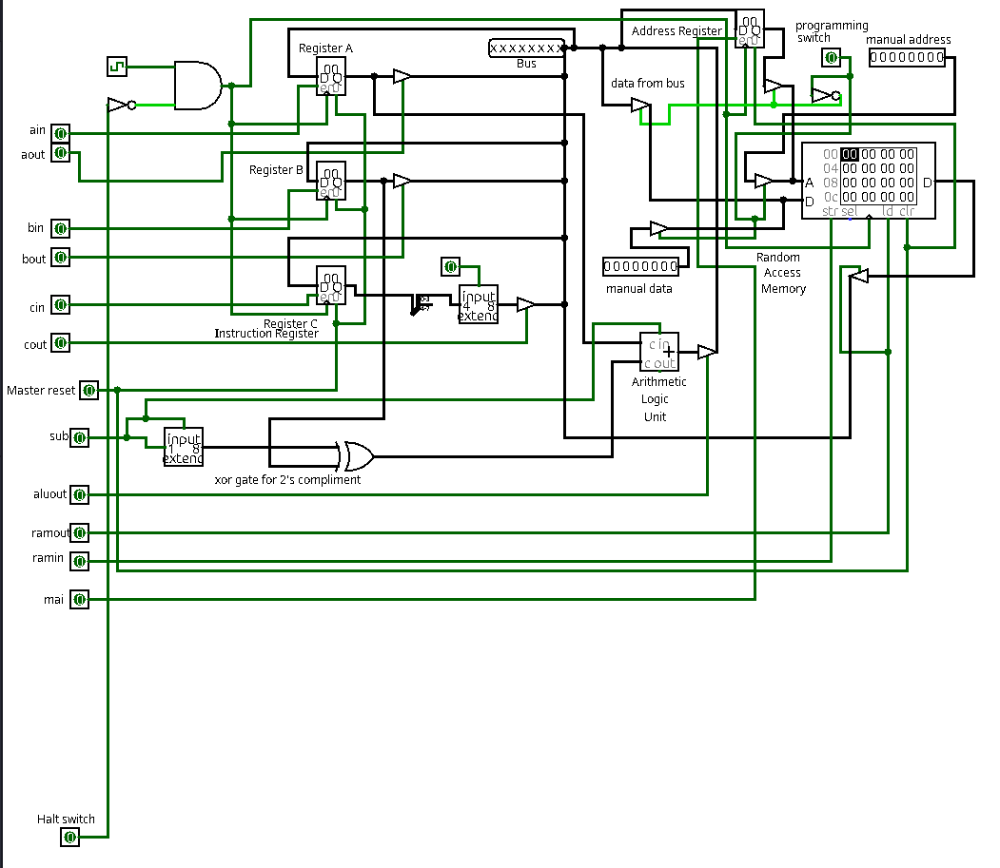

# Random Access Memory (RAM) - 8-Bit Computer
 |  |
 |:---------------------------------------:|
 | **Figure 1**: Circuit Diagram of RAM added to the circuit in logisim |
   

## Overview
The RAM in this 8-bit computer is an essential component for temporary data storage and retrieval. It is an 8-bit RAM with an 8-bit address bus, giving it a capacity of **256 bytes** (not 32 bytes). This memory serves as the primary storage for instructions and data during operation.

## Design and Features
### 8-Bit Addressable Memory
- **Capacity**: The RAM can store up to 256 bytes, with each address corresponding to one byte of data.
- **Addressing**: An 8-bit address bus allows addressing all 256 memory locations (0x00 to 0xFF).

### Dual Operating Modes
The RAM features two distinct modes of operation:
1. **Programming Mode**:
   - In this mode, users can manually insert data into specific memory addresses.
   - The address and corresponding value can be set using external switches or controls, providing a simple interface for direct memory programming.
   - This mode is primarily used for loading programs or test data into RAM.

2. **Operational Mode**:
   - In operational mode, the RAM interacts with the rest of the computer, loading addresses and data directly from the bus.
   - The computer can fetch or write data during program execution without manual intervention.

### Integration with the Bus
- **Address Bus**: The RAM receives an 8-bit address from the computer’s address bus, specifying the memory location for read/write operations.
- **Data Bus**: Data is either written to or read from the memory via the shared 8-bit data bus.

## How It Works
1. **Programming Mode**:
   - The user sets the desired memory address and data manually.
   - A "write" control signal is activated to store the data into the specified memory address.

2. **Operational Mode**:
   - The computer sends an address to the RAM via the address bus.
   - A "read" or "write" signal determines whether data is retrieved from or written to the specified address.

## Key Benefits
- **Flexibility**: The dual-mode operation allows both manual programming and automated operation.
- **Simplicity**: The 8-bit design keeps the implementation straightforward while still being functional for small programs.
- **Expandability**: While the current implementation is limited to 256 bytes, the design can be extended for larger address spaces if needed.

The RAM’s dual-mode functionality makes it a versatile and vital part of this 8-bit computer, enabling both program loading and dynamic operation.

