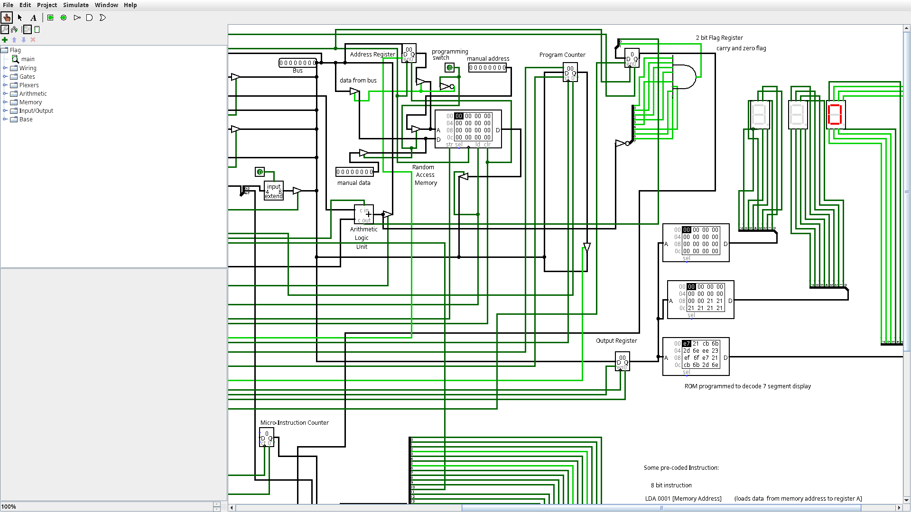

# 2-Bit Flag Register
|  |
|:---------------------------------------:|
| **Figure 1**: Circuit Diagram of Flag Register added to circuit in Logisim |

Implemented 2-bit flag register for an 8-bit computer simulation. The register is used to store the **Zero Flag (ZF)** and **Carry Flag (CF)** after arithmetic operations. 
	
## Flag Details
- **High bit (1)**: Zero Flag (ZF)  
  - Set to `1` if the result of an operation is zero.  
  - Set to `0` otherwise.  
- **Low bit (0)**: Carry Flag (CF)  
  - Set to `1` if the operation generates a carry (addition) or borrow (subtraction).  
  - Set to `0` otherwise.  

## Integration
The flags are updated by the control logic and are essential for handling conditional operations, such as jumps or branches, in the simulation. 

