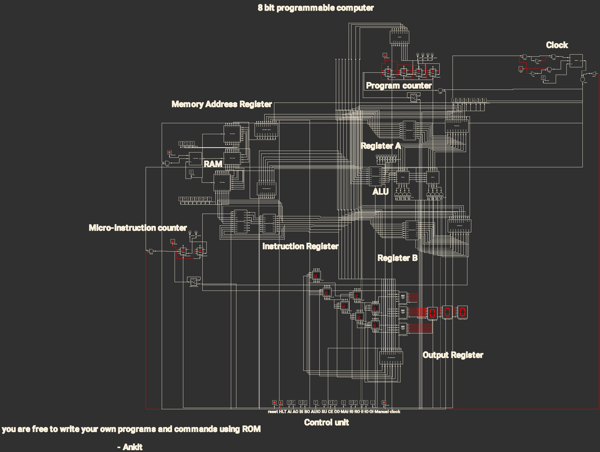
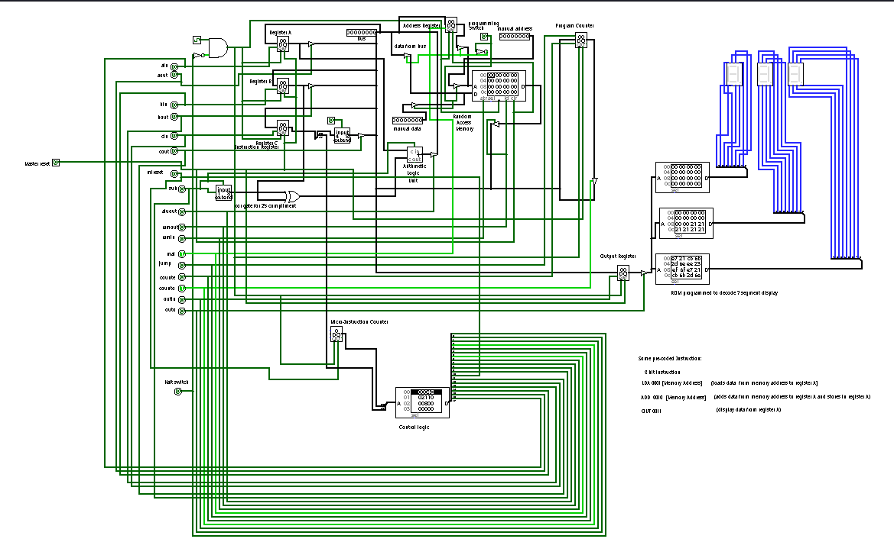

# 8-Bit Computer Project

Welcome to my 8-bit computer project, a journey into the world of computer architecture using **Logisim**. This project began two years ago, inspired by the incredible insights shared by **Ben Eater**, a renowned computing YouTuber. His detailed explanations of how computers work at a fundamental level sparked my curiosity and motivated me to create my first version of this project.
|  |
|:---------------------------------------:|
| **Figure 1**: Circuit Diagram of the 8-bit Computer in logic circuit simulator Pro |

[The final design should look like this](8bitComputer/complete8bitcomputer/8bitcomputer.circ)
|  |
|:---------------------------------------:|
| **Figure 1**: Circuit Diagram of the 8-bit Computer in Logisim |

Now, I am revisiting the project to improve it, document every step, and share it with the community. This time, I aim to provide a more comprehensive understanding of the design process and showcase the power of digital logic simulation tools.

---

## Acknowledgments

A heartfelt thanks to **Ben Eater**, whose content has been an invaluable resource. His passion for teaching complex concepts with simplicity and clarity has had a profound impact on me. If you’re interested in learning about computer architecture, I highly recommend checking out his YouTube channel.

---

## Project Objectives

1. **Revisit and Enhance**: Build upon my original design, refining the logic and adding enhancements where necessary.
2. **Document and Share**: Thoroughly document each component and the overall architecture to make the project accessible to others.
3. **Community Contribution**: Provide a resource for those interested in learning about 8-bit computer design through Logisim.

---

## Features

- **Central Processing Unit (CPU)**: Simulates the core logic for executing instructions.
- **Arithmetic Logic Unit (ALU)**: Handles basic arithmetic and logical operations.
- **Registers**: Temporary storage for instructions and data.
- **Memory Module**: Stores programs and data for the computer to process.
- **Control Logic**: Coordinates the flow of data and execution of instructions.

---

## Getting Started

### Prerequisites
1. Download and install [Logisim-evolution](https://github.com/logisim-evolution/logisim-evolution) on your system.
2. Ensure you have Java 11 or higher installed.

### Running the Project
1. Clone this repository:
   ```bash
   git clone https://github.com/Godvein/8-bit-computer.git
   cd 8-bit-computer

